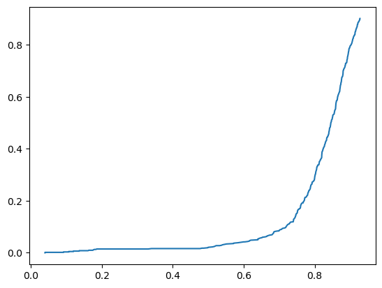
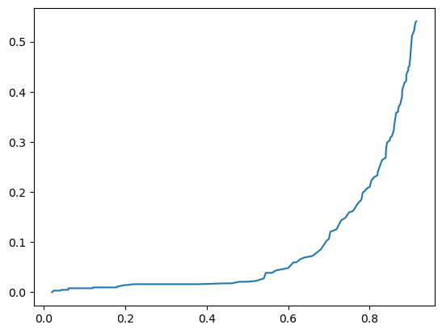
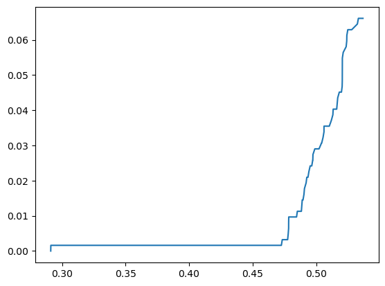
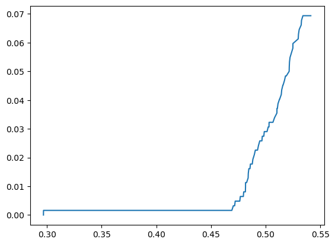

Aqui vamos tentar escolher quais modelos manteremos, mais de 2 fica dificil de mante e entender em quem acreditar, muita gente falando na cabeça e já tenho muitas vozes nela, então vamos simplificar.

**Qual nosso principal objetivo?**

- Identificar todos asteroides potencialmente perigosos;
- Não deixar a nossa querida raça humana ser pega desprevinida com qualquer asteoide colidindo com nosso planeta e destruindo toda a vida.

**Catapimbas, Ora bolas, mas o que isso significa?**

- Minimizar falsos negativos;
- Então vamos abusar de falsos positivos.

Não vamos deixar os modelos predizerem o classe, vamos pedir que retorne probabilidades e então avaliar nosso threashold, que vamos reduzir até conseguirmos minimizar o erro tipo 2, o que automaticamente pode inflacionar o tipo 1.

Divisão do dataset será apenas em 2 partes, treino e teste, deixaremos a validação para o próximo artigo. Variaremos o scaler, entre Standard e o MinMax, e manteremos o que estiver perfomando melhor.

**Vantagens de utilizar scaling no problema**

1. Dependendo do modelo treina mais rapido;
2. Resposta não precisar de scaling;
3. Não precisar explicar parametros reescalados ou transformar de volta em algum momento.

**Primeiros passos no codigo**
Primeiro precisamos dividir o dataset, depois aplicar o scaler, pois o scaler precisa primeiro ver o subset de treino, depois escalar o teste.

    x,y = get_x_y()
    x_train,x_test,y_train,y_test = train_test_split(x,y,
                                            test_size=0.3,
                                            stratify=y,
                                            random_state=42
                                            )
    scaler = MinMaxScaler()
    x_train = scaler.fit_transform(x_train)
    x_test = scaler.transform(x_test)

Essa função get_x_y pode ser vista em modules no repositorio. Ela retorna já com as dummies para não precisarmos ficar preocupados com isso nos notebooks. Para o codigo ficar mais limpo possivel.  
Optamos por escalar as covariaveis com MinMaxScaler pois estava performando melhor do que com StandardScaler.

### Benchmark Models

Para benchmark comecei com modelos simples, decision tree e knn, só lembrei que knn iria demorar pra sempre com esse dataset depois de começar a rodar porem esperei.  
Ambos performaram excessivamente mal, a humanindade estaria perdida.  
Mesmo reduzindo a probabilidade de aceite pra 0.05 o modelo performou dessa maneira. Como introduzimos, queremos a posição (1,0) seja minima possivel, com foco em chegar em 0, então esse é um mal exemplo.  
**Precisão da classe: 520/620**

            N     Y
    N  277984  1097
    Y     100   520

Vamos agora focar em minimizar esse valor, vamos abusar no erro tipo 2 mas não a ponto dele ficar 50% maior do que do knn.

Definidos os requisitos:

1. Precisão da classe mais próximo de 100% possivel;
2. Erro tipo 2 menor que 1500.

### Bons resultados

Não vou colocar todas interações de todos modelos e nem todos que testei, 3 bons que cheguei a bons resultados para compararmos, foram Adaboost e RandomForest e o a multilayer neuralnet with tensorflow.

Escolha dos parâmetros. Tirados das curvas de falso negativo. A escolha foi para mostrar o ponto onde falta apenas aquele unico asteroide que não conseguimos remover.

#### RandomForestClassifier

    rf = RandomForestClassifier(n_estimators=80)

| MinMaxScaler                | StandardScaler             |
| --------------------------- | -------------------------- |
|  |  |

Dadas curvas acima e matrizes de confusão ficamos com o minmaxscaler pois parece ajudar o modelo a distanciar melhor as classes, vemos a curva mais acentuada.

**Modelo com MinMaxScaling**

<table>
<tr><th> 0.5 </th><th> 0.25  </th><th> 0.05 </th></tr>
<tr><td>

<table><tr><td></td><td>N</td><td>Y</td></tr><tr><td>N</td><td>279072</td><td>9</td></tr><tr><td>Y</td><td>14</td><td>606</td></tr></table>

</td><td>

<table><tr><td></td><td>N</td><td>Y</td></tr><tr><td>N</td><td>279070</td><td>11</td></tr><tr><td>Y</td><td>10</td><td>610</td></tr></table>

</td><td>

<table><tr><td></td><td>N</td><td>Y</td></tr><tr><td>N</td><td>278534</td><td>670</td></tr><tr><td>Y</td><td>1</td><td>619</td></tr></table>

</td></tr> </table>

#### AdaBoostClassifier

    ada = AdaBoostClassifier()

| MinMaxScaler                  | StandardScaler               |
| ----------------------------- | ---------------------------- |
|  |  |

No caso do AdaBoost não fez tanta diferença, o modelo já parece separar muito bem as classes, vemos que em 0.47 o modelo já parece reconhecer todas e deixar apenas o asteroide que está no nosso sapato. Ou nas nossas cabeças.

**Modelo com MinMaxScaling**

<table>
<tr><th> 0.5 </th><th> 0.47  </th><th> 0.40 </th></tr>
<tr><td>

<table><tr><td></td><td>N</td><td>Y</td></tr><tr><td>N</td><td>279071</td><td>10</td></tr><tr><td>Y</td><td>18</td><td>602</td></tr></table>

</td><td>

<table><tr><td></td><td>N</td><td>Y</td></tr><tr><td>N</td><td>279031</td><td>50</td></tr><tr><td>Y</td><td>1</td><td>619</td></tr></table>

</td><td>

<table><tr><td></td><td>N</td><td>Y</td></tr><tr><td>N</td><td>278534</td><td>147</td></tr><tr><td>Y</td><td>1</td><td>619</td></tr></table>

</td></tr> </table>

#### Tensorflow

No caso do nosso ultimo modelo mantivemos com MinMax pois funcinou nos outros e já fizemos uma bateria de escolha do modelo descrita pela tabela baixo.  
Deixamos treinar para 25 e 50 epochs. Com 25 epochs já obtivemos o mesmo resultado que os modelos anteriores, faltando isolar 1. Como esse modelo performou em geral pior que o adaboost e o random forest baseado nos Falsos positivos. Vamos fazer nossa ultima tentativa tentando forçar a barra.  
Então utilizando a função abaixo fizemos um com 5 camadas, [10,16,16,8,1], a saída é binaria de qualquer forma.

    # in modules
    def declare_model(n_layers=[16,8],loss = "binary_crossentropy",
                        optimizer = "adam", last_layer_activation = sigmoid"):
        tf_model = Sequential()
        tf_model.add(Dense(10, activation='relu', input_shape=(38,)))
        for i in n_layers[1:]:
            tf_model.add(Dense(i, activation='relu'))
        tf_model.add(Dense(1, activation=last_layer_activation))
        tf_model.compile(loss=loss, optimizer=optimizer, metrics = [tf.keras.metrics.Precision(),'accuracy'])
        return tf_model

**Multilayer 100 epochs**
Abusando do tensorflow vamos tentar forçar a barra do modelo um pouco,

    tf_model = declare_model([16,16,10])
    tf_model.fit(x_train,y_train, epochs=100, batch_size=64, verbose=1)

<table>
<tr><th> 0.5 </th><th> 0.25  </th><th> 0.05 </th></tr>
<tr><td>

<table><tr><td></td><td>N</td><td>Y</td></tr><tr><td>N</td><td>279028</td><td>53</td></tr><tr><td>Y</td><td>30</td><td>590</td></tr></table>

</td><td>

<table><tr><td></td><td>N</td><td>Y</td></tr><tr><td>N</td><td>278907</td><td>186</td></tr><tr><td>Y</td><td>3</td><td>617</td></tr></table>
</td><td>

<table><tr><td></td><td>N</td><td>Y</td></tr><tr><td>N</td><td>278704</td><td>402</td></tr><tr><td>Y</td><td>0</td><td>620</td></tr></table>
</td></tr> 
</table>

## Conclusões

Chegamos no nosso objetivo, diminuimos a quantidade de modelos pra 3. Nessa ultima etapa aplicaremos validação cruzada com os modelos para tirar metricas mais bem avaliadas.

Todos tiveram performance muito boa, todos utilizando 0.5 de probabilidade de classificação obtem poucos erros tipo 1 e 2. Quando vamos diminuindo esse limite até 0.05 vamos isolando os outros asteroides potencialmente perigosos até restar apenas 1. No caso do ultimo modelo conseguimos retirar até esse ultimo asteroide no sapato.
Vamos descobrir se podemos confiar nessas estimativas no próximo artigo onde aplicamos o K-folds.

#### [Próximo artigo: Artigo 5](https://johnholz.github.io/eda/2022/07/12/5validationchoosed.html)
